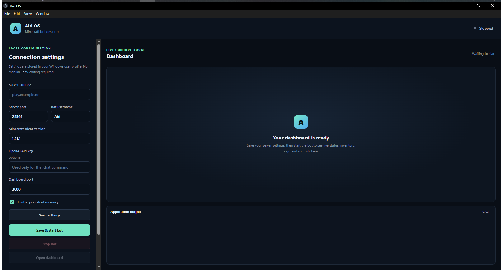

# Airi OS

**A configurable Minecraft bot with a live dashboard and a Windows desktop app.**

<p align="center">
  
</p>

The desktop app brings server configuration, connection status, application output, and the existing web dashboard together in one window. You can also run the bot directly with Node.js.

## Features

- **Windows desktop app** with server address, port, username, Minecraft client version, dashboard port, memory toggle, and optional OpenAI key settings.
- **Installer mode selection:** install normally with shortcuts and an uninstall entry, or use portable mode in a folder of your choice.
- **Live dashboard** for connection state, vitals, coordinates, inventory, equipment, logs, and bot controls.
- **Bot automation** for navigation, mining, gathering, crafting, survival, and combat.
- **Persistent memory** for locations, recognized players, the current task, rules, and learned facts.
- **Optional AI chat** through OpenAI.

## Windows desktop app

### Use the installer

Download or build the installer, run it, and choose one of the two modes:

- **Install normally** creates Windows shortcuts and an uninstall entry. Settings and memory are stored in the current Windows user's application-data folder.
- **Portable mode** keeps the app in the selected folder, creates `portable.txt` beside `Airi OS.exe`, and stores settings and memory in `portable-data` beside the executable. It does not create Windows shortcuts or an uninstall entry.

The optional OpenAI key is encrypted using Windows secure storage. It is tied to the Windows user account, so it is not automatically portable between different accounts or computers.

Build the x64 installer from source:

```bash
npm install
npm run desktop:dist
```

The installer is created in `dist/`. To run the desktop app from source during development:

```bash
npm run desktop
```

### Run an unpacked portable copy

Place an empty `portable.txt` beside `Airi OS.exe` and launch it. The app will create `portable-data` beside the executable for settings and memory.

## Configure and start

In Airi OS, enter:

| Setting | Purpose |
| --- | --- |
| Server address and port | Minecraft server to connect to |
| Bot username | In-game username used by the bot |
| Minecraft client version | Mineflayer-supported client version; choose one compatible with the server |
| Dashboard port | Local port used by the embedded dashboard |
| Persistent memory | Enables or disables reading and writing the memory file |
| OpenAI API key | Optional; used for the in-game `:chat` command |

Save settings, then select **Save & start bot**. The local dashboard server listens on loopback when launched by the desktop app. Use **Stop bot** to stop the child bot process.

## Run with Node.js

Requirements: Node.js 18 or newer and a Minecraft server reachable by the machine running the bot.

```bash
npm install
```

Create a `.env` file in the project root:

```env
MC_HOST=localhost
MC_PORT=25565
MC_USERNAME=Airi
MC_VERSION=1.21.1
WEB_PORT=3000
ENABLE_MEMORY=true
OPENAI_KEY=your_openai_api_key
```

Start the bot or run it with Node's watch mode:

```bash
node bot.js
npm run dev
```

Then open `http://localhost:3000` in a browser. Do not commit `.env` or publish API keys.

## Persistent memory

With `ENABLE_MEMORY=true`, Airi stores structured data in `memory.json`: saved locations, recognized players, the current task, behavioral rules, and learned facts. Set `ENABLE_MEMORY=false` to disable memory file reads and writes.

In the desktop app, memory is stored alongside the desktop settings: in Windows application data for a normal installation, or in `portable-data` for portable mode.

In-game, use `:remember <key>=<fact>` to save a fact and `:forget <key>` to remove one.

## In-game commands

Commands use `:` for public actions. Admin actions use `$` after authenticating in a private message with `$loginadmin <password>`.

| Command | Action |
| --- | --- |
| `:ping`, `:status`, `:coords` | Check responsiveness, task status, or location |
| `:chat <message>` | Ask the configured AI assistant |
| `:sbase [x y z]`, `:home` | Save a home location or return to it |
| `:sminebase`, `:minebase` | Save or return to a mining base |
| `:miner <north\|south\|east\|west> [length]` | Dig a tunnel |
| `:lumberjack [radius]` | Gather nearby logs |
| `:rescue`, `:medic <player>` | Provide nearby player support |
| `:sort`, `:deposit`, `:refuel` | Manage nearby storage and resources |
| `:remember <key>=<fact>`, `:forget <key>` | Manage persistent learned facts |
| `$guard`, `$pvp <player>`, `$stoppvp` | Admin defense and combat controls |
| `$mine <block>`, `$servercmd <command>` | Admin mining or server command |

Use `:help` in game for the bot's current command list.

## Project structure

- `bot.js` — Mineflayer bot, reconnect handling, web server, and Socket.IO updates.
- `index.html` — Browser dashboard.
- `desktop/` — Electron desktop app, settings form, and renderer.
- `build/installer.nsh` — Windows installer mode selection.
- `memory.js` / `memory.json` — Persistent memory support and initial schema.

## Notes

- A version accepted by Mineflayer is not necessarily identical to the server's version; select a compatible client version when connecting through ViaVersion.
- The installer is currently configured for Windows x64.
- Bot actions that mine, build, or interact with other players can change a shared world. Test those actions in a safe area or server.
